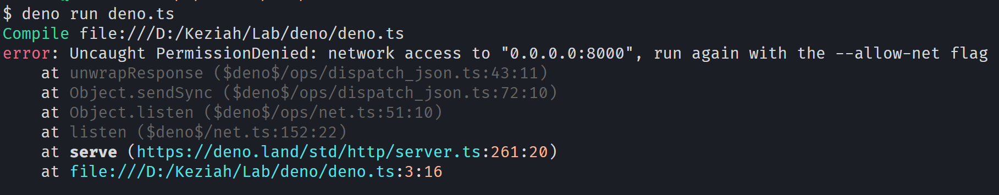

"*I imagine him standing in the rain at night - stoically facing the dark battle that is software engineering.*"

## Introduction

Deno came out 1 week ago and made a lot of noise in the JavaScript community, articles like "*Is Node.js dead ?*" "*Deno is the new Node.js*" and so on, so we had to talk a bit about Deno and WHY Deno has been created ? What are the differences between the two ?

Node.js was created in 2009 and at that time JavaScript was totally different from what we are used to now, Ryan Dahl had to make choices to advance the JavaScript ecosystem.

## Node.js pain points

### Promises

One of the most important thing he regret is that he added support for Promises in 2009 and removed it one year later because it wasn't a standard yet and it added a lot of code to support both callbacks and promises.

### Security

One thing he didn't think about is security, in Node we have access to all sort of system calls, for example your linter can access the network or system layer and potentially do malicious things. In this ecosystem it's common to install a lot of modules but what if one module contains malicious code ?

### Modules

Talking about modules, NPM became the de facto standard way to install modules, it wasn't a part of Node at first. NPM is a big centralized registry and we currently have no free way to know exactly what are we installing on our projects.

Also there is this well known issue "node_modules" weight.

The module system was also a mistake because it wasn't a part of Node at first it added a lot of complex code for the modules resolution (non explicit require, no extension, index.js) a lot of possibilities that needed to be added to the resolution algorithm that didn't need to exists

### Build system

Added to all of that there is "GYP" you probably read some errors in your terminal about node-gyp errors ? Yeah... That was also a big mistake, Node.js is the sole user of GYP that has been abandoned by Google long ago and there is a lot of maintenance to do for it to work.

## Deno

You see that Node.js have several pain points for both maintainers and developers and Deno try to solve all of this, here's how :

### Promises and async/await

All asynchronous code in Deno returns a Promise, no more `util.promisify`

async/await is the easiest way to consume and abstract Promises, it is widely used in Deno and so it supports top level await, that means we don't need to write code like this in order to use `await` 

```jsx
import fetch from '...'

async function main () {
	const response = await fetch()

	console.log(response)
}

main()
```

Instead we can just write `await` at the "top level" :

```jsx
import fetch from '...'

const response = await fetch()

console.log(response)
```

### Security

JavaScript has always been a secure sandbox (the browser where the browser gives us some permissions), Deno embraces this idea it is secured by default, if you want to do HTTP calls you will need to run your program with the flag `—allow-net`



### Modules

Again Deno embraces the standard and uses ESM "EcmaScript Modules", the `import` and `export` syntax, the browser API require the extension and a relative or an URL like so :

```html
<script type="module" src="1.mjs"></script>
<script type="module" src="https://other-origin/1.mjs"></script>
```

In Deno it looks like this :

```jsx
import { serve } from "https://deno.land/std/http/server.ts";
```

As you can see it's stricter but it removes the module resolution complexity, also there is a proposal for the browser named "Import maps" it allows us to write imports like we used to, it's a JSON that will "map" a name to an URL.

In Deno it will look like this :

```json
// import-map.json
{
  "imports": {
    "http/": "https://deno.land/std/http/"
  }
}
```

The import map file can now be used using the flag `--importmap=import_map.json` it will now map import from `http/` to the URL automatically so we don't have to write the URL everywhere. For this to work you will need to use the flag `—unstable`

After that we can import like so :

```jsx
import { serve } from "http/server.ts";
```

### TypeScript

TypeScript is built into Deno, that doesn't mean you need to use TypeScript, it means you CAN use TypeScript features in your code without building anything on your end it is done directly by Deno.

### Deno and the Browser

As you can see Deno try as much as possible to replicate APIs between the browser and the runtime, that means you can use browser APIs in Deno just like you are used to.

In Node.js the global variable is named `global` in Deno it's the same as the browser : `window` 

For example you have access to common APIs like `fetch` or `Worker`

### Misc

- Deno is a single executable which ships with great utilities like a formatter; a test runner, a bundler...
- Deno instantly die upon unhandled exceptions (this is still not the case with Node.js)

## Conclusion

As you can see Deno tries its best to fix mistakes made in Node.js but nothing is perfect it will not replace Node.js anytime soon and there is still a lot of things to fix and add to the runtime.

It's still great seeing new alternatives emerge, it can help existing solutions to become better.

In the meantime if you want to try Deno you can [read the documentation](https://deno.land/)